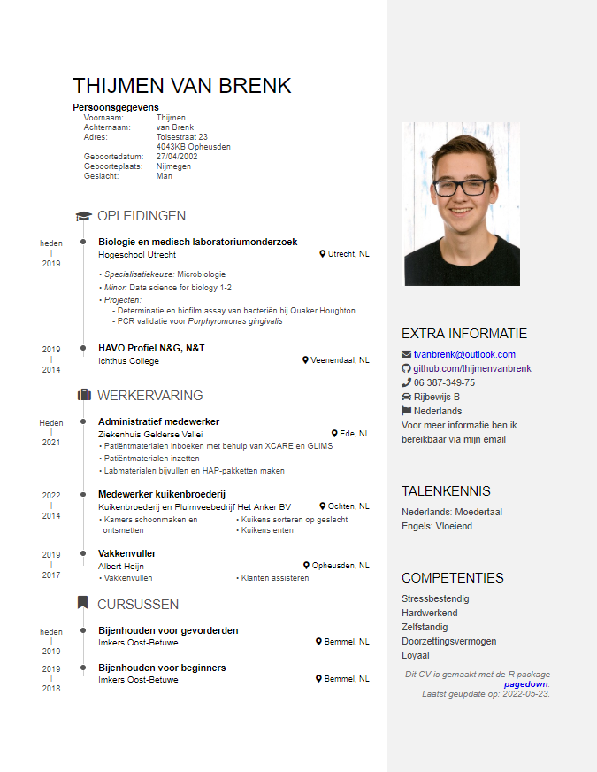

# Personality

## CV
Below you can see my CV       
         
Because making the CV uses special headers its not possible to knit it into bookdown, thats why this is just the picture of the CV. the orginal code can be found in this repository at: "data/CV_thijmenvanbrenk.Rmd"

