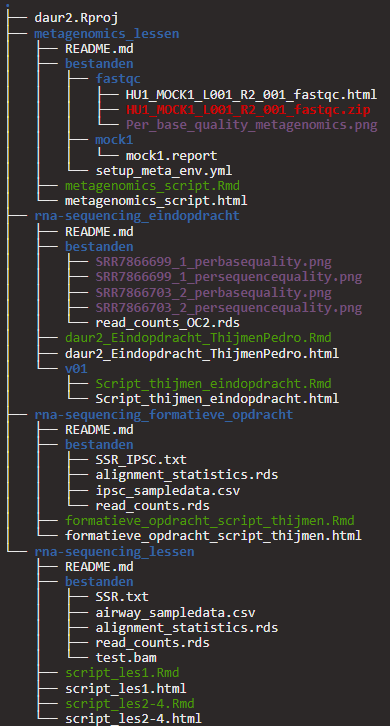

## Organisation of my files

Storing files in a way everyone knows where they can find everything makes it easier for your colleagues or complete strangers to find what they are looking for.       
Down below you can see the file structure from one of my previous projects. As you can see all the files are stored in a similar way and can be easily found.        

