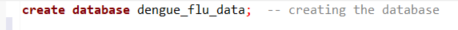
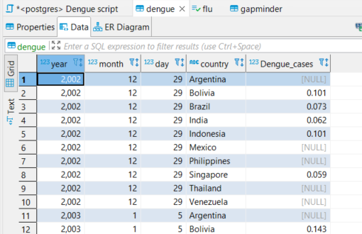
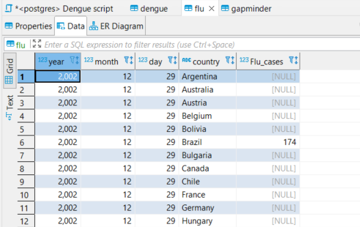
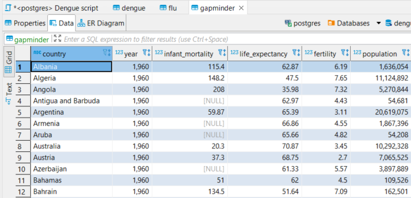

## Using SQL to store data

Databases are an important feature of data science (it is even in the name), thats why being able to request data from a database is equally as important as actually analyzing the data.        

First we need to make a new database, this has been done with the use of DBeaver and the code for creating the database can be found below.        

        

after creating the database we need to make a connection with DBeaver.        
to reproduce this:        
* make a new database in dbeaver called "*dengue_flu_data*".        
* insert your own password in the yaml header of this file in my repository.        
<br>        
*IMPORTANT MESSAGE*: The source of the data used for these analyses is NOT available anymore, so the conclusions that have been formed based on the graphs are conclusions based on data that can not be confirmed anymore.


```r
library(DBI)

con <- dbConnect(RPostgres::Postgres(),
                 dbname = "dengue_flu_data",
                 host = "localhost",
                 port = "5432",
                 user = "postgres",
                 password = params$password)
```


```r
library(tidyverse)
library(dslabs)
library(car)

gapminder <- gapminder
dengue_data <- read_csv("data/dengue_data.csv", skip = 11)
flu_data <- read_csv("data/flu_data.csv", skip = 11)

dengue_data %>% head(5)
```

```
## # A tibble: 5 x 11
##   Date       Argentina Bolivia Brazil India Indonesia Mexico Philippines
##   <date>         <dbl>   <dbl>  <dbl> <dbl>     <dbl>  <dbl>       <dbl>
## 1 2002-12-29        NA   0.101  0.073 0.062     0.101 NA              NA
## 2 2003-01-05        NA   0.143  0.098 0.047     0.039 NA              NA
## 3 2003-01-12        NA   0.176  0.119 0.051     0.059  0.071          NA
## 4 2003-01-19        NA   0.173  0.17  0.032     0.039  0.052          NA
## 5 2003-01-26        NA   0.146  0.138 0.04      0.112  0.048          NA
## # ... with 3 more variables: Singapore <dbl>, Thailand <dbl>, Venezuela <dbl>
```

```r
flu_data %>% head(5)
```

```
## # A tibble: 5 x 30
##   Date       Argentina Australia Austria Belgium Bolivia Brazil Bulgaria Canada
##   <date>         <dbl>     <dbl>   <dbl>   <dbl>   <dbl>  <dbl>    <dbl>  <dbl>
## 1 2002-12-29        NA        NA      NA      NA      NA    174       NA     NA
## 2 2003-01-05        NA        NA      NA      NA      NA    162       NA     NA
## 3 2003-01-12        NA        NA      NA      NA      NA    174       NA     NA
## 4 2003-01-19        NA        NA      NA      NA      NA    162       NA     NA
## 5 2003-01-26        NA        NA      NA      NA      NA    131       NA     NA
## # ... with 21 more variables: Chile <dbl>, France <dbl>, Germany <dbl>,
## #   Hungary <dbl>, Japan <dbl>, Mexico <dbl>, Netherlands <dbl>,
## #   `New Zealand` <dbl>, Norway <dbl>, Paraguay <dbl>, Peru <dbl>,
## #   Poland <dbl>, Romania <dbl>, Russia <dbl>, `South Africa` <dbl>,
## #   Spain <dbl>, Sweden <dbl>, Switzerland <dbl>, Ukraine <dbl>,
## #   `United States` <dbl>, Uruguay <dbl>
```
As we can see both the flu and dengue data are not tidy ( > 1 observations per row). This can easily be fixed with pivot_longer()


```r
dengue_tidy <- dengue_data %>% pivot_longer(cols = Argentina:Venezuela,
                                            names_to = "country",
                                            values_to = "Dengue_cases")
dengue_tidy %>% head(5)
```

```
## # A tibble: 5 x 3
##   Date       country   Dengue_cases
##   <date>     <chr>            <dbl>
## 1 2002-12-29 Argentina       NA    
## 2 2002-12-29 Bolivia          0.101
## 3 2002-12-29 Brazil           0.073
## 4 2002-12-29 India            0.062
## 5 2002-12-29 Indonesia        0.101
```

```r
flu_tidy <- flu_data %>% pivot_longer(cols = Argentina:Uruguay,
                                      names_to = "country",
                                      values_to = "Flu_cases")
flu_tidy %>% head(5)
```

```
## # A tibble: 5 x 3
##   Date       country   Flu_cases
##   <date>     <chr>         <dbl>
## 1 2002-12-29 Argentina        NA
## 2 2002-12-29 Australia        NA
## 3 2002-12-29 Austria          NA
## 4 2002-12-29 Belgium          NA
## 5 2002-12-29 Bolivia          NA
```

```r
# data is now tidy
```

If we want to eventually merge these 3 data files together we need to make the date and country variables equal:        
-- Date from flu and dengue data need to be split into year, month, day.       
-- Country needs to be of class factor.       


```r
dengue_tidy$country <- as.factor(dengue_tidy$country) 
flu_tidy$country <- as.factor(flu_tidy$country)

dengue_tidy <- dengue_tidy %>% separate(Date, into = c("year", "month", "day"), convert = T, sep = "-")
flu_tidy <- flu_tidy %>% separate(Date, into = c("year", "month", "day"), convert = T, sep = "-")
```

We will store this data so we always have our tidy versions by hand.


```r
dengue_tidy %>% write.csv("data/denguetidy.csv")
dengue_tidy %>% write_rds("data/denguetidy.rds")

flu_tidy %>% write.csv("data/flutidy.csv")
flu_tidy %>% write_rds("data/flutidy.rds")

gapminder %>% write.csv("data/gapminder.csv")
gapminder %>% write_rds("data/gapminder.rds")
```

Now we can insert these dataframes into SQL. 


```r
dbWriteTable(con, "dengue", dengue_tidy)
dbWriteTable(con, "flu", flu_tidy)
dbWriteTable(con, "gapminder", gapminder)
```

To check if everything imported correctly we will go to DBeaver and inspect the data.





We can also get the datasets back and check them using R


```r
dengueSQL <- dbReadTable(con, "dengue")
fluSQL <- dbReadTable(con, "flu")
gapminderSQL <- dbReadTable(con, "gapminder")

fluSQL %>% head(5)
```

```
##   year month day   country Flu_cases
## 1 2002    12  29 Argentina        NA
## 2 2002    12  29 Australia        NA
## 3 2002    12  29   Austria        NA
## 4 2002    12  29   Belgium        NA
## 5 2002    12  29   Bolivia        NA
```

```r
gapminderSQL %>% head(5)
```

```
##               country year infant_mortality life_expectancy fertility
## 1             Albania 1960           115.40           62.87      6.19
## 2             Algeria 1960           148.20           47.50      7.65
## 3              Angola 1960           208.00           35.98      7.32
## 4 Antigua and Barbuda 1960               NA           62.97      4.43
## 5           Argentina 1960            59.87           65.39      3.11
##   population          gdp continent          region
## 1    1636054           NA    Europe Southern Europe
## 2   11124892  13828152297    Africa Northern Africa
## 3    5270844           NA    Africa   Middle Africa
## 4      54681           NA  Americas       Caribbean
## 5   20619075 108322326649  Americas   South America
```
It seems like inserting it into DBeaver and pulling it back changes the data classes for every variable.        
This is not a big problem, we just have to make sure to change the classes of certain values whenever we import something from DBeaver.        
We can now combine these 3 dataframes into 1 big dataframe based on country and year.       


```r
flu_dengue_combined <- full_join(dengueSQL, fluSQL, by = c("country", "year", "month", "day"))

# lets check how many years all 3 dataframes are covering

flu_dengue_combined$year %>% min()
```

```
## [1] 2002
```

```r
flu_dengue_combined$year %>% max()
```

```
## [1] 2015
```

```r
# flu and dengue have a range from 2002 to 2015

gapminderSQL$year %>% min()
```

```
## [1] 1960
```

```r
gapminderSQL$year %>% max()
```

```
## [1] 2016
```

```r
# gapminder has a range from 1960 to 2016.
# we dont need all those years so we will cut those out

gapminder_filtered <- gapminderSQL %>% filter(year >= 2002) %>% filter(year <= 2015)

# lets update the gapminder data in SQL so it only contains this dataframe instead of the big one because it is not required

dbWriteTable(con, "gapminder", gapminder, overwrite = T)

# now we can combine all the data frames

combined_all <- full_join(flu_dengue_combined, gapminder_filtered, by = c("country", "year"))
```


```r
dbWriteTable(con, "gap_flu_den", combined_all)
```

Now that we have a table with all the data combined we can ask SQL to extract specific data to do some analysis on.       

Lets say we want to know if there is a difference in the amount of flu cases of brazil and argentina in 2007.


```r
# getting all the relevant data

arg_bra_flucases <- dbGetQuery(con, 
                                  "SELECT 
                                      \"month\",
                                      country, 
                                      gfd.\"Flu_cases\", 
                                      population
                                   FROM 
                                      gap_flu_den gfd
                                   WHERE 
                                      country IN (\'Argentina\', \'Brazil\') AND
                                      \"year\" = 2007;")

# because brazil has a much higher population we will use the cases per 100.000 citizens.

arg_bra_flucases <- arg_bra_flucases %>% mutate(per_100.000 = Flu_cases * 100000 / population)

summary_arg_bra_flu <- arg_bra_flucases %>%
  group_by(month, country) %>%
  summarise(total = sum(per_100.000))
```

```
## `summarise()` has grouped output by 'month'. You can override using the
## `.groups` argument.
```

```r
summary_arg_bra_flu %>%
  ggplot(aes(x = month.name[month], y = total, colour = country)) +
  geom_point() +
  geom_path(aes(group = country)) +
  labs(title = "Flu cases per 100.000 citizens in argentina and brazil",
       subtitle = "Data from 2007",
       x = "Month of the year",
       y = "Cases per 100.000 citizens") +
    scale_x_discrete(limits = month.name) +
  theme_classic() +
  theme(axis.text.x = element_text(angle = 60, vjust = 0.7))
```


```r
# on first glance Argentina seems to have more cases per 100.000 citizens, but just to make sure we will do a two sample t-test

summary_arg_bra_flu %>%
  group_by(country) %>%
  summarise(p.value.normality = shapiro.test(total)$p.value)
```

```
## # A tibble: 2 x 2
##   country   p.value.normality
##   <chr>                 <dbl>
## 1 Argentina             0.210
## 2 Brazil                0.312
```

```r
# both have p > 0.05, so they are normally distributed, now we can continue with levennes test.

leveneTest(summary_arg_bra_flu$total, as.factor(summary_arg_bra_flu$country), center = mean)$P
```

```
## [1] 0.0001063121           NA
```

```r
# p < 0.05, so they do not have equal variance. we can now perform the t test

t.test(formula = summary_arg_bra_flu$total ~ summary_arg_bra_flu$country,
       paired = F, var.equal = F)$p.value
```

```
## [1] 0.0003999675
```

```r
# p < 0.001, There is a significant difference between the total amount of cases per 100.000 citizens in Argentina and Brazil.
```

This had some interesting results. lets try something different this time.        
Lets see if some south-east asian countries have reduced their dengue infections between 2002 - 2015.


```r
SEAsia_dengue_cases <- dbGetQuery(con, 
                                  "SELECT 
                                      gfd.\"year\",
                                      gfd.\"Dengue_cases\",
                                      country
                                   FROM 
                                      gap_flu_den gfd
                                   WHERE 
                                      country IN (\'Singapore\', \'Indonesia\', \'Thailand\', \'Philippines\')")

summary_SEAsia_den_cases <- 
  SEAsia_dengue_cases %>%
  group_by(year, country) %>%
  summarize(total = sum(Dengue_cases))
```

```
## `summarise()` has grouped output by 'year'. You can override using the
## `.groups` argument.
```

```r
summary_SEAsia_den_cases %>%
  ggplot(aes(x = year, y = total, colour = country)) +
  geom_point() +
  geom_line() +
  scale_x_continuous(breaks = seq(2002, 2015, by = 2)) +
  labs(title = "Total dengue cases per year",
       x = "Year",
       y = "Total cases per year") +
  theme_classic()
```

```
## Warning: Removed 9 rows containing missing values (geom_point).
```

```
## Warning: Removed 9 row(s) containing missing values (geom_path).
```


The dengue cases seem to stay mostly stagnant with a few peaks here and there for every country, but in 2015 all dengue cases seem to have dropped which could be a good sign.       
Now lets take a look at one last graph. It is always said that the flu peak is always during winter because the cold makes it easier for the influenza virus to infect people. lets check this for ourselves by checking the flu incidence for the year 2009 in 5 northern hemisphere countries.


```r
flu_incidence_northern <- dbGetQuery(con,
                                     "SELECT
                                        country,
                                        \"month\",
                                        gfd.\"Flu_cases\"
                                      FROM 
                                        gap_flu_den gfd
                                      WHERE 
                                        country IN (\'Netherlands\', \'Norway\', \'France\', \'Sweden\', \'Switzerland\') AND
                                        \"year\" = 2009")

summary_flu_inc_north <- flu_incidence_northern %>%
  group_by(month, country) %>%
  summarize(total = sum(Flu_cases))
```

```
## `summarise()` has grouped output by 'month'. You can override using the
## `.groups` argument.
```

```r
summary_flu_inc_north %>%
  ggplot(aes(x = month.name[month], y = total, group = country, fill = country)) +
  geom_col(position = position_dodge()) +
  labs(title = "Flu incidence for different countries",
       subtitle = "Data from 2009",
       x = "Month",
       y = "Flu incidence") +
  scale_x_discrete(limits = month.name) +
  theme_classic() +
  theme(axis.text.x = element_text(angle = 60, vjust = 0.8))
```


<br>        
As we can see in this graph, most flu incidence occurs during the winter so saying that people get sick from the flu in the winter would be correct.
