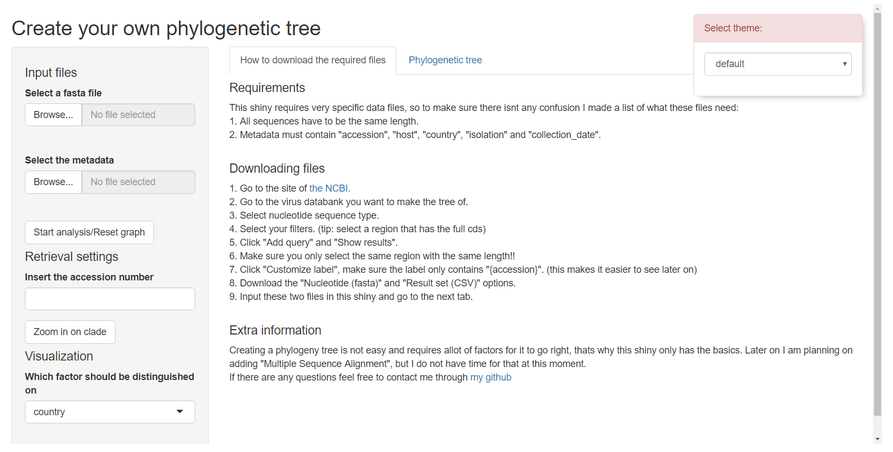
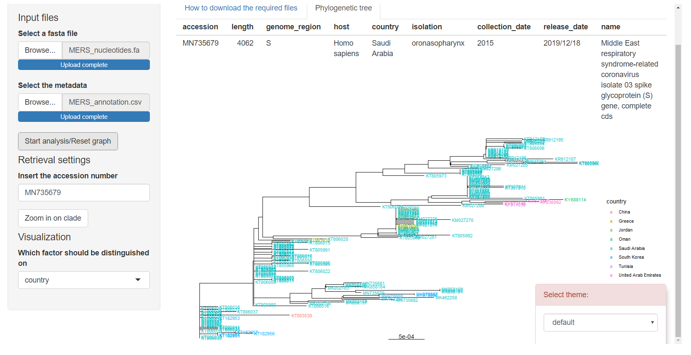
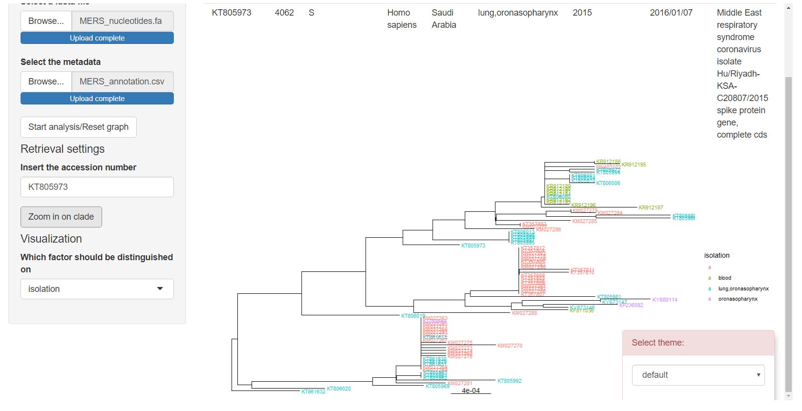

## Creating an epidemiology map

With the infrastructure we have created to make it easier for people to connect, we have also made the infrastructure for diseases to spread. Many of these diseases cause allot of trouble and can weaken whole societies, just take a look at SARS-COV-19. To figure out how these diseases spread is essential to figure out how a pathogen behaves. Figuring this out gives us the possibility to take precautions so it does not happen again, as can be seen by this report from the [CDC.](https://www.cdc.gov/eis/downloads/epidemiology-factsheet.pdf)        
In my future I want to be able to process epidemiological data to figure out where a disease originated, how it spread to different people and make this data easily readable for non data scientists with the help of shiny.       
To learn these skills I have made a small plan for a few steps I want to go through:        
1.    Find a suitable outbreak with available data.       
2.    Process the data to get simple phylogenetic trees.        
3.    Add regions to these trees.       
4.    Create a shiny to make it easy for others to create these graphs       
5.    Give more parameters, like showing only specific regions or adding different species. (optional depending on time)       
<br>        

### Finding an outbreak

To be able and actually to create phylogenetic trees I need to have some data available to me.        
I dont want a massive amount of data like from the covid pandemic because this would be too much data to process while this is only for my own learning purpose.        
the NCBI has a very detailed database of different virus variation, for this exercise I will be using the data from the MERS-Cov outbreak (2013-2019).       
If you want to download this data for yourself go to [THIS SITE](https://www.ncbi.nlm.nih.gov/genome/viruses/variation/) and follow the following steps:        
1. Go to "MERS coronavirus"
2. Select nucleotide sequence type.       
3. Select Human host.        
4. Select S genome region.       
5. Click "additional filters", type "complete cds" and switch to definition lines.        
6. Click "Add query".        
7. Click "Show results". (this will redirect you to a new screen)       
8. Make sure only the S genome regions are selected!        
9. Click "Customize label", make sure the label only contains "\{accession\}". (this makes it easier to see later on)        
10. Click "Download" with as download option "Nucleotide (FASTA)".        
11. Click "Download" but now with as download option "Result set (CSV)". (This is the metadata)       
<br>        
You now have 2 files:       
1. The nucleotide sequence of all samples taken from human hosts with the accession number.       
2. The metadata that shows all the information for each accession number.       
<br>        
I will only be working with these 2 datafiles.        

### Creating Phylogenetic trees

For learning how to create these phylogenetic trees I have taken inspiration from a small tutorial on how to create Phylogenetic trees. You can find this tutorial [Here](https://fuzzyatelin.github.io/bioanth-stats/module-24/module-24.html).       
After getting an idea of how to make these trees I have taken further inspiration from ggtree and all the help for that on google.


```r
# now we need to load in the nucleotides
dna <- readDNAStringSet(here("data/MERS_nucleotides.fa"))
dna
```

```
## DNAStringSet object of length 168:
##       width seq                                             names               
##   [1]  4062 ATGATACACTCAGTGTTTCTAC...GCATAAGGTTCATGTTCACTAA KT805988
##   [2]  4062 ATGATACACTCAGTGTTTCTAC...GCATAAGGTTCATGTTCACTAA KT805968
##   [3]  4062 ATGATACACTCAGTGTTTCTAC...GCATAAGGTTCATGTTCACTAA KT357808
##   [4]  4062 ATGATACACTCAGTGTTTCTAC...GCATAAGGTTCATGTTCACTAA KM027279
##   [5]  4062 ATGATACACTCAGTGTTTCTAC...GCATAAGGTTCATGTTCACTAA KT805976
##   ...   ... ...
## [164]  4062 ATGATACACTCAGTGTTTCTAC...GCATAAGGTTCATGTTCACTAA KM027264
## [165]  4062 ATGATACACTCAGTGTTTCTAC...GCATAAGGTTCATGTTCACTAA MH978886
## [166]  4062 ATGATACACTCAGTGTTTCTAC...GCATAAGGTTCATGTTCACTAA KT806039
## [167]  4062 ATGATACACTCAGTGTTTCTAC...GCATAAGGTTCATGTTCACTAA KM027269
## [168]  4062 ATGATACACTCAGTGTTTCTAC...GCATAAGGTTCATGTTCACTAA KY673146
```

```r
# and the metadata
metadata <- read.csv(here("data/MERS_annotation.csv"))
metadata %>% head(5) %>% knitr::kable()
```


|accession | length|genome_region |host         |country      |isolation      |collection_date |release_date |name                                                                                                            |
|:---------|------:|:-------------|:------------|:------------|:--------------|:---------------|:------------|:---------------------------------------------------------------------------------------------------------------|
|KJ782549  |   4062|S             |Homo sapiens |Greece       |oronasopharynx |2014/04/18      |2014/05/13   |Middle East respiratory syndrome coronavirus strain Greece-Saudi Arabia_2014 S protein (S) gene, complete cds   |
|KF811036  |   4062|S             |Homo sapiens |Tunisia      |blood          |2013/05/08      |2014/05/19   |Middle East respiratory syndrome coronavirus strain Tunisia-Qatar_2013 spike protein gene, complete cds         |
|KM027263  |   4062|S             |Homo sapiens |Saudi Arabia |               |2014            |2014/11/12   |Middle East respiratory syndrome coronavirus isolate Jeddah_C7058/KSA/2014 spike protein (S) gene, complete cds |
|KM027264  |   4062|S             |Homo sapiens |Saudi Arabia |               |2014            |2014/11/12   |Middle East respiratory syndrome coronavirus isolate Jeddah_C7209/KSA/2014 spike protein (S) gene, complete cds |
|KM027265  |   4062|S             |Homo sapiens |Saudi Arabia |               |2014            |2014/11/12   |Middle East respiratory syndrome coronavirus isolate Jeddah_C7311/KSA/2014 spike protein (S) gene, complete cds |

```r
# we only want the years from the metadata so lets extract those
metadata <- metadata %>% separate(collection_date, into = "collection_date", sep = 4)
metadata$collection_date <- as.numeric(metadata$collection_date)


# the DNA is loaded in nicely with the exact amount of downloaded sequences.
# there is no multiple sequence alignment necessary for these sequences, this is because they all come from the same part of the DNA.

dna <- as.DNAbin(dna) # sequence has to be the correct class

# to create a phylogenetic tree we need to calculate the distance between all the sequences
# there are many different models to choose from, and it was not easy to choose out of all the options because there are allot of upsides and allot of downsides to all the possible methods. for this time I have chosen to use the Tamaru and Nei methode (TN93). Because they take into account that its different to swap from A-G then C-T and vice versa.

dna_distance <- dist.dna(dna, model = "TN93")

# lets start by making a very simple neighbour joining phylogenetic tree.

nj_tree <- bionj(dna_distance)
plot(nj_tree, cex = .4)
```


```r
# this is the most simplistic phylogenetic tree to be made and just shows the relation between the different samples.
# now lets change it up so it isnt as clutured and make it give the information we actually want

# we can also make it our tree rooted by adding the first sample ever taken

nj_rooted <- root(nj_tree, 1) %>% ladderize()

# performing a bootstrap will not only tell us how good our lines are, it also give us the option to collapse some of them

# we have to load the dna back with another method because otherwise boot.phylo cannot recognize it for some reason
dna_boots <- fasta2DNAbin(here("data/MERS_nucleotides.fa"))
```

```
## 
##  Converting FASTA alignment into a DNAbin object... 
## 
## 
##  Finding the size of a single genome... 
## 
## 
##  genome size is: 4,062 nucleotides 
## 
## ( 60  lines per genome )
## 
##  Importing sequences... 
## ..........................................................................................................................................................................................................................................................................................................................................................................................................................................................................................................................................................................................................................................................................................................................................................................................................................................................................................................................................................................................................................................................................................................................................................................................................................................................................................................................................................................................................................................................................................................................................................................................
##  Forming final object... 
## 
## ...done.
```

```r
bootstrap <- boot.phylo(nj_rooted, dna_boots, function(e) {root(bionj(dist.dna(e, model = "TN93")), 1)})
```

```
## 
Running bootstraps:       100 / 100
## Calculating bootstrap values... done.
```

```r
# now we can add our bootstrap values
plot(nj_rooted, cex = .4)
axisPhylo()
nodelabels(bootstrap, cex = .7)
```


```r
    # now we can collapse some of our nodes that have too low values
    nj_collapsed <- nj_rooted

    # step 1: figure out the row numbers of the branches that can be collapsed
    N <- length(nj_rooted$tip.label)
    tocollapse <- match(which(bootstrap<65)+N, nj_rooted$edge[,2])

    # step 2: get rid of those branches
    nj_collapsed$edge.length[tocollapse] <- 0
    nj_collapsed <- di2multi(nj_collapsed, tol = 0.00001)

    # step 3: check if it worked by plotting this new tree
    plot(nj_collapsed, cex = .45)
```


```r
# lets add some nice colours to the plot so we can see the countries more easily

nj_tree_withcolours <- ggtree(nj_collapsed) +
                          geom_treescale()
    
    metadata$country <- as.factor(metadata$country)


nj_tree_withcolours <- nj_tree_withcolours %<+% metadata +
  geom_tiplab(aes(color = country), size = 2.5)

nj_tree_withcolours
```


```r
# we can even zoom in on some parts of the tree

zoomed <- ggtree(tree_subset(nj_tree, "MK462258")) +
  geom_treescale()

zoomed %<+% metadata +
  geom_tiplab(aes(color = country), size = 2.5)
```


### Making Phylogeny automated
Now that I have created something I want to be able to show easily, without all the hassle of recreating this code over and over again, I will implement this into a shiny so its more user friendly.         
Because hosting a shiny in bookdown is not possible without launching it as an app I will just include the code. The original file can be found at "data/phylo.shiny.Rmd".


```r
ui <- fluidPage(
  
  # makes you choose your own theme (I like themes (: )
  shinythemes::themeSelector(),
  
  titlePanel("Create your own phylogenetic tree"),
  
  sidebarLayout(
    sidebarPanel(
      
      h4("Input files"),
      
      fileInput(inputId = "fasta_file",
                label = "Select a fasta file",
                accept = ".fa"),
      
      fileInput(inputId = "metadata",
                label = "Select the metadata",
                accept = ".csv"),
      
      actionButton(inputId = "go",
                   label = "Start analysis/Reset graph"),
      
      h4("Retrieval settings"),
      
      textInput(inputId = "accession",
                label = "Insert the accession number"),
      
      actionButton(inputId = "zoom",
                   label = "Zoom in on clade"),
      
      h4("Visualization"),
      
      selectInput(inputId = "colour",
                  label = "Which factor should be distinguished on",
                  choices = c("country", "host", "isolation", "collection_date"),
                  selected = "country"),
      
      width = 3
    
    ),
    
    mainPanel(
      tabsetPanel(
        tabPanel("How to download the required files",
                 tags$div(
                   tags$h4("Requirements"),
                   "This shiny requires very specific data files, so to make sure there isnt any confusion I made a list of what these files need:",
                   tags$br(),
                   "1. All sequences have to be the same length.",
                   tags$br(),
                   "2. Metadata must contain \"accession\", \"host\", \"country\", \"isolation\" and \"collection_date\".",
                   tags$br(), tags$br(),
                   tags$h4("Downloading files"),
                   "1. Go to the site of ",
                   tags$a(href="https://www.ncbi.nlm.nih.gov/genome/viruses/variation/", "the NCBI."),
                   tags$br(),
                   "2. Go to the virus databank you want to make the tree of.",
                   tags$br(),
                   "3. Select nucleotide sequence type.",
                   tags$br(),
                   "4. Select your filters. (tip: select a region that has the full cds)",
                   tags$br(),
                   "5. Click \"Add query\" and \"Show results\".",
                   tags$br(),
                   "6. Make sure you only select the same region with the same length!!",
                   tags$br(),
                   "7.  Click \"Customize label\", make sure the label only contains \"{accession}\". (this makes it easier to see later on) ",
                   tags$br(),
                   "8. Download the \"Nucleotide (fasta)\" and \"Result set (CSV)\" options.",
                   tags$br(),
                   "9. Input these two files in this shiny and go to the next tab.",
                   tags$br(),tags$br(),
                   tags$h4("Extra information"),
                   "Creating a phylogeny tree is not easy and requires allot of factors for it to go right, thats why this shiny only has the basics. Later on I am planning on adding \"Multiple Sequence Alignment\", but I do not have time for that at this moment.",
                   tags$br(),
                   "If there are any questions feel free to contact me through",
                   tags$a(href="https://github.com/thijmenvanbrenk", "my github"
                   ))),
        
        tabPanel("Phylogenetic tree",
                 tableOutput("meta"),
                 plotOutput("phylo"))
        
        
      
          ),
        
        
          width = 9)
    
  )
)
```

This is what the ui looks like.



```r
server <- function(input, output, session) {
  
  # inputting the fasta file
  
  nucleotides <- reactive({
  
    req(input$fasta_file)
    
    readDNAStringSet(input$fasta_file$datapath)
  
  })
  # inputting the metadata file
  
  metadata <- reactive({
    
    req(input$metadata)
    
    read.csv(input$metadata$datapath)
  })
  # extracting just the years from metadata
  
  metadata_year_temp <- reactive({
    
    metadata() %>% separate(collection_date, into = "collection_date", sep = 4)
  })
  # making inputted tree
  
  nj_tree <- reactive({
    
    as.DNAbin(nucleotides()) %>%
      dist.dna(model = "TN93") %>%
      bionj()
  })

  # time to make the graph
  
  # first create te full graph
  tree_foundation <- reactive({
    
    ggtree(nj_tree()) +
      geom_treescale()
  
    })
  
  tree_full <- reactive({
    
    tree_foundation() %<+% metadata_year_temp() +
       geom_tiplab(aes_string(color = input$colour), size = 3)
  })
  
  # then the zoomed in graph
  tree_zoomed <- reactive({
   ggtree(tree_subset(nj_tree(), input$accession)) +
  geom_treescale()
  })
  
  tree_zoomed_full <- reactive({
    
    tree_zoomed() %<+% metadata_year_temp() +
  geom_tiplab(aes_string(color = input$colour), size = 3)
  })
  
  # now tell shiny which to show when
  
  tree_output <- reactiveValues(plot=NULL)
  
  observeEvent(input$go, {
  
    tree_output$plot <- tree_full()
  })
  
  observeEvent(input$zoom, {
    
    tree_output$plot <- tree_zoomed_full()
  })
  
  # now we can output the plot
  output$phylo <- renderPlot({
  
    if(is.null(tree_output$plot)) {
      
    } else {
    tree_output$plot
    }
    })
  
  # show the information about the selected accession code
  output$meta <- renderTable({
    
    output_table <- metadata_year_temp() %>% 
      filter(metadata_year_temp()$accession == input$accession)
    
    if(nrow(output_table) == 0) {
      validate("This accession number does not exist")
    } else {
      output_table
    }
    
  })
  
}

shinyApp(ui, server, options = list(height=650, width = 1300))
```

And these are pictures of the server in action, it can create graphs like these.




